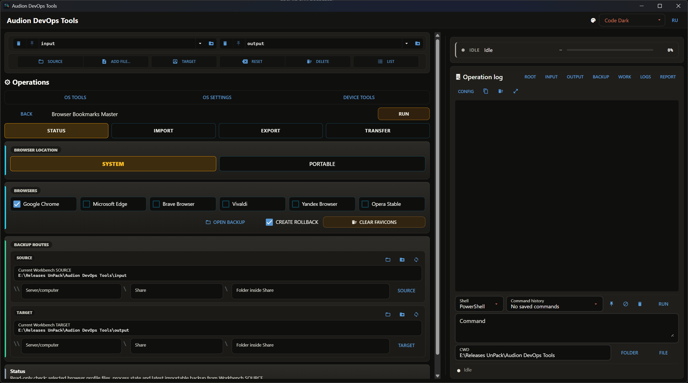

# Audion DevOps Tools

<!-- audion:release -->
<p align="center">
  <a href="https://audion.dev/downloads/devops-tools"></a>
  <a href="https://github.com/Tensionix/devops-tools/releases/latest"></a>
  <a href="https://github.com/Tensionix/devops-tools/releases"></a>
  <a href="https://github.com/Tensionix/devops-tools/blob/main/LICENSE"></a>
</p>

**Version 1.8.2** · 2026-09-04 · 193.5 MB

- [Direct download](https://audion.dev/get/devops-tools/1.8.2/Audion_DevOps_Tools_v1.8.2_Full.zip) — unmetered, no rate limits
- [Project page](https://audion.dev/downloads/devops-tools) — every version and how to install

<p align="center"></p>

`SHA-256: bddcf55d2f9113cd2e9c69f4fc15a7137519cbb9ddb736b5928835292140df16`

---

An **Audion** tool, published by [Tensionix](https://github.com/Tensionix).
<!-- /audion:release -->


[Русский](Docs/README_RU.md) · [User Guide](Docs/USER_GUIDE_EN.md)

**Contents**

- [Why It Exists](#why-it-exists)
- [Principles](#principles)
- [What Is Inside](#what-is-inside)
- [Next](#next)
- [Technical Reference](#technical-reference)
  - [Running](#running)
  - [Maintenance](#maintenance)
  - [Verification](#verification)
  - [Structure](#structure)
  - [Workbench Naming](#workbench-naming)
  - [Microsoft Documentation Behind It](#microsoft-documentation-behind-it)

A portable shell for precise operations on Windows: the Linux subsystem,
virtualisation, drivers and hardware, disks, networking, file associations, keys
and certificates.

## Why It Exists

There is a class of tasks with no good tool for them. Not "speed up Windows" and
not "strip out the bloat" — but do one precise thing and know exactly what you
did: install a Linux distribution from a file, switch the machine between Hyper-V
and a third-party hypervisor, stop Windows Update from replacing a graphics
driver, snapshot file associations before and after installing something, export
a certificate together with its private key.

Each of those is done by different means: `wsl.exe` here, `bcdedit` there, a
registry policy somewhere else, PowerShell commands elsewhere again. They are all
documented, but scattered — and half of them require remembering what to roll
back if it goes wrong.

This program gathers them in one place, with explicit parameters, risk labels, a
backup before every change, and a live log.

**It is not a debloater and not a collection of tweaks.** Associations are not
forged by defeating Windows protections, and the registry is not edited directly
where a documented mechanism exists. The program wraps the standard
administration tools rather than fighting the system.

## Principles

**Wrap what is documented.** The Linux subsystem goes through `wsl.exe`. Wi-Fi
profiles through `netsh wlan`. Associations through the deployment mechanism and
machine-wide policy. Certificates through PowerShell over the system stores. User
choice hashes and the protection around them are never bypassed by hand.

**A copy before the change.** The boot configuration, associations, the `hosts`
file, network state, the driver store — anything that changes is snapshotted into
`backup\` first.

**A risk label on every command.** Muted button tones separate the gentle, the
ordinary, and the forceful; dangerous actions require confirmation. Paired
workflows — backup and restore, export and import, block and unblock — are framed
together so the way back is always in view.

**The interface is deliberately technical.** Buttons are short, captions compact,
and the full context — what exactly will happen, what you risk, how to undo it —
lives in the tooltip. Space is saved on the caption, not on the explanation.

**An unsupported edition is not a target.** Home editions of Windows do not
guarantee that group policies apply; the program shows the edition and by default
refuses to apply where it would not work.

**Nothing is pulled from neighbouring folders.** Every tool lives inside the
project. Historical folders are read only for comparison or recovery, and only
when explicitly asked.

## What Is Inside

| section | about |
|---|---|
| Linux subsystem | features and updates, install from the network or a file, status, backup, clone, move, delete, register disks |
| Virtualisation | read-only status and diagnostics, Hyper-V or third-party mode, coexistence, toggles with a boot-config backup and reboot warnings |
| Networking | diagnostics, backup and restore of network state, proxy, adapters, sign-in to shared folders, Wi-Fi profiles, quick modes |
| Hosts and Bitrix | redirecting an address to a local endpoint, endpoint detection, DNS and port status, byte-exact restoration of `hosts` from backup |
| Associations | snapshot and comparison of defaults, policy protection, Microsoft built-in apps — remove, restore, keep removed — reinstall blocking, change tracking |
| Hardware and drivers | blocking drivers from updates, graphics driver restrictions, driver store backup, HDMI and DisplayPort audio, disk inventory, recovery environment, SSD wizard |
| Keys | export and import of SSH keys and certificates, gathering every credential into one folder with an inventory, moving to a new machine |
| Maintenance | backup of command-assistant memory, documentation export, shortcuts, bundled file search |

## Next

* [User Guide](Docs/USER_GUIDE_EN.md) — working through the sections, and the order of
  operations for the dangerous subsystems.

---

## Technical Reference

### Running

```bat
launcher_gui.cmd
```

An ordinary launch raises the whole window as administrator — needed for
deployment, the `hosts` file, network adapters, disk work, and Linux subsystem
setup.

Individual entry points for one section:

```bat
cli\launcher_wsl.cmd
cli\launcher_bitrix.cmd
cli\launcher_default_apps.cmd
cli\launcher_association_defense.cmd
cli\launcher_hardware.cmd
cli\launcher_docs_pdf.cmd
```

They go through the same manifest and service layer as the window, so behaviour
matches.

Read-only, without the elevation prompt:

```bat
set AUDION_GUI_NO_ELEVATE=1
launcher_gui.cmd
```

### Maintenance

```bat
init_folders.cmd                  create missing working folders
cleanup_project.cmd               careful cleanup
cleanup_project.cmd /DRYRUN /Y    show the plan, delete nothing
```

Cleanup keeps scripts, configuration, documentation, licences, and the folders
themselves. It removes what was generated or downloaded: the runtime, the wheel
store, builds, downloads, logs, reports, working-folder contents, and caches.

### Verification

```bat
runtime\python.exe -m py_compile system_core\ui_nicegui\app.py system_core\services\devops_tools.py system_core\core\jobs.py
runtime\python.exe system_core\ui_nicegui\app.py --smoke
runtime\python.exe system_core\doctor.py
```

### Structure

```
config\tool_manifest.yaml      command tree, fields, risk metadata
config\gui_settings.yaml       window settings at startup
config\ui_colors.yaml          theme catalogue
system_core\ui_nicegui\        the window
system_core\core\jobs.py       operation runner, output decoding
system_core\services\          system actions
system_core\cli_operation.py   running an operation from the command line
tools\                         project-local utilities
backup\                        snapshots and rollback data
logs\                          operation logs
```

**The service boundary.** The window holds no system logic: it collects
parameters, shows risk and confirmation, and calls the operation through the
manifest and service layer. System actions live in services, project modules, and
project scripts; operation definitions live in `tool_manifest.yaml`.

### Workbench Naming

One shared vocabulary across all Audion projects. The buttons are always named the
same: **Source**, **Add file…**, **Target**, **Reset**, **Delete**, **List**. In
Russian: **Источник**, **Добавить файл…**, **Назначение**, **Сбросить**,
**Удалить**, **Список**.

`Reset` restores the project folders and deletes no files. `Delete` clears the
current source and target only after confirmation. The words `Destination`,
`Clear`, «Цель», and «Очистить» are not used for these controls.

### Microsoft Documentation Behind It

* [Application defaults policy](https://learn.microsoft.com/en-us/windows/client-management/mdm/policy-csp-applicationdefaults)
* [Associations through deployment servicing](https://learn.microsoft.com/en-us/windows-hardware/manufacture/desktop/dism-default-application-association-servicing-command-line-options?view=windows-11)
* [Wi-Fi profiles](https://learn.microsoft.com/en-us/windows-server/administration/windows-commands/netsh-wlan)
* [Linux subsystem commands](https://learn.microsoft.com/en-us/windows/wsl/basic-commands)

Exports of SSH keys, certificates with private parts, and Wi-Fi passwords are
sensitive: the resulting archives are stored as secrets.
